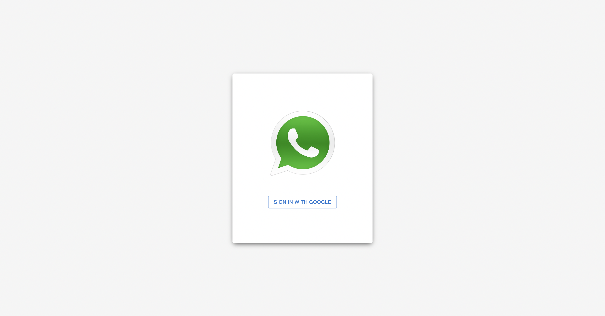
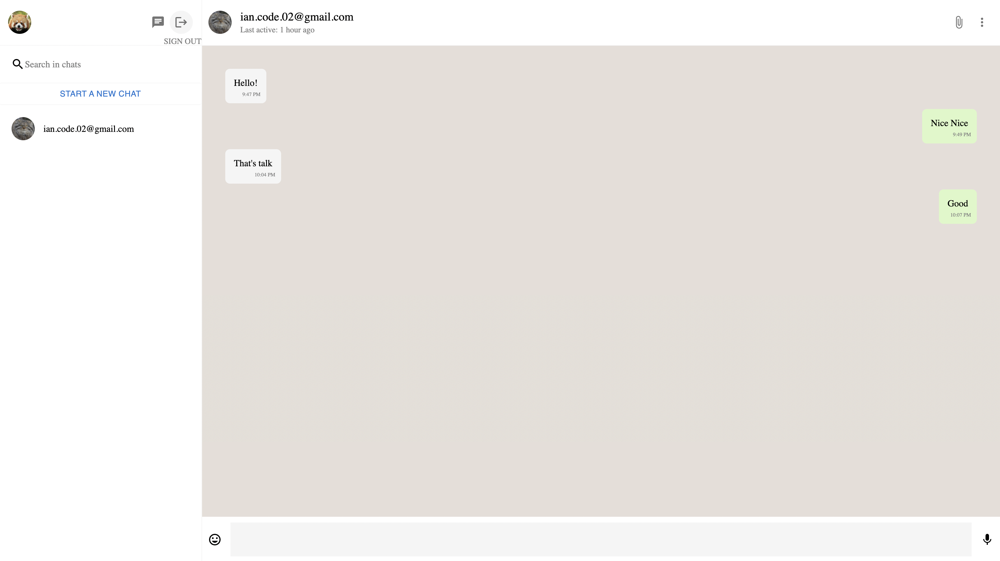
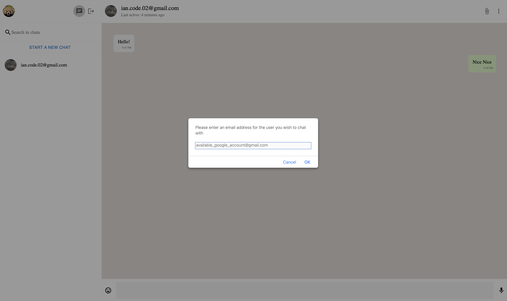
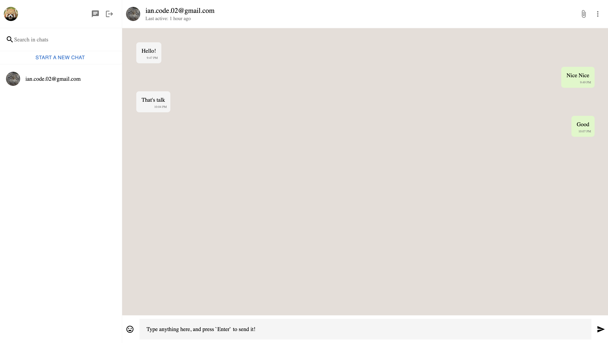

# Whatsapp clone

[Demo](https://whatsapp-clone-enhsu.vercel.app/)

[Source Code](https://github.com/enhsu/whatsapp-clone)

This is a simple `Whatsapp clone` project. Useing `react-firebase-hooks`, which can retrieve and monitor a collection value in Cloud Firestore, to implement the real-time chatting.

See this project's [developement notes](./NOTES/README.md) here

This is a [Next.js](https://nextjs.org/) project bootstrapped with [`create-next-app`](https://github.com/vercel/next.js/tree/canary/packages/create-next-app).

## Tec

- [Next](https://nextjs.org/)
- [React](https://reactjs.org/)
- [styled-components](https://styled-components.com/)
- [MUI](https://mui.com/)
- [Typescript](https://www.typescriptlang.org/)
- [Firebase](https://firebase.google.com/)
- [React Firebase Hooks](https://www.npmjs.com/package/react-firebase-hooks)

## Implement function

- SignIn with google account
  
- SignOut
  
- Add chat with email address
  
- Text only message
  

## Getting Started

First, run the development server:

```bash
npm run dev
# or
yarn dev
```

Open [http://localhost:3000](http://localhost:3000) with your browser to see the result.

## Deploy on Vercel

The easiest way to deploy your Next.js app is to use the [Vercel Platform](https://vercel.com/new?utm_medium=default-template&filter=next.js&utm_source=create-next-app&utm_campaign=create-next-app-readme) from the creators of Next.js.

Check out our [Next.js deployment documentation](https://nextjs.org/docs/deployment) for more details.
